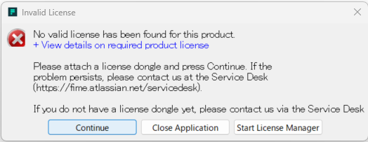
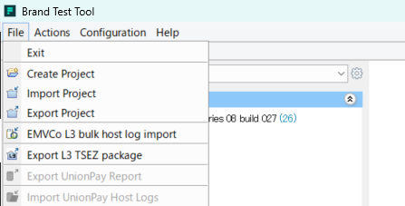

# ブランド試験実施要領

## クイックスタート

### 準備するもの

- ULテストツール本体  
  6階入り口横のキャビネットに保管。

- BTT アプリケーション  
  PC に以下をインストールする。  
  brand-test-tool-580-setup_v2.exe

  ※ 保管場所：  
  \\192.168.254.22\製品別\電子決済\FeliCaDoc\01 開発\040_EMVブランド試験\ULブランドテストツール(ULBTT)\5.8.0

  ※ アップデートされている場合、バージョン番号が異なる。  
     上記は 2026/01 現在のインストーラ名。


### 開始

1. BTT アプリケーションを起動する。

   - PC に ULテストツール本体 付属の USB が刺さっていない場合、  
     以下のダイアログがでて起動できない。

     USB を指して、"Continue" を押下する。

        


2. ブランドテストプロジェクトをオープンする。

   - アプリケーションメニューの `File` からプロジェクトをオープンできる。

        

   - ブランドテストを新しく作成するか、既存のテストプロジェクトを使うかで以降の操作が異なります。


        1. テストを作成する場合

            <span style="color: red">
            TODO：工事中
            </span>  

        2. 既存テストを実行する場合

           `File` -> `Import Project` で拡張子 ".tpp" のファイルをインポートできます。
           ".tpp" はブランドテストのプロジェクトファイルです。

           [実行編](./02_Execute.md) に進む。

        ```
        【TIPS】
        慣例的に１つのプロジェクトファイルに１ブランド／１端末タイプ分の試験を含むように構成している。
        ```

          

### 結果のエクスポート

1. ブランドテストプロジェクトをエクスポートする。

    `File` -> `Export Project` で tpp ファイルに取り出すことができます。    
    このファイルは試験の実行結果も含みます。

