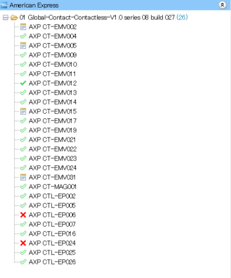

# ブランド試験実施要領 実行編

## 1. 対象の端末, 実施する試験ファイルを確認

通常、試験を実施したい端末の種類やアプリケーションごとに  
管理フォルダを定義します。

例えば PT-630 （決済アプリケーション）の場合は、以下のフォルダに格納しています。

```
【TIPS】
2026/01 確認。

※ 保管場所：
\\192.168.254.22\製品別\電子決済\FeliCaDoc\01 開発\040_EMVブランド試験\試験結果\PT-751_PT-630
```

テストケース作成済の場合、保管してある tpp ファイルをツールに Import します。  
テストケースが定義されていない場合は先に作成する必要があります。

```
【TIPS】
慣例的に１つのプロジェクトファイルに１ブランド／１端末タイプ分の試験を含むように構成している。
```

#### ファイルのインポート後

以下は "AMEX PT-630 CVM_2025_12_23_16_22.tpp" のインポート後サンプルです。

（tpp には試験結果も記録されている）



## 2. 端末設定

アプリケーションの開発環境通信先の定義を以下のように変更してインストールします。  
変更後のURLはブランドと通信が行えるよう構成されたテストサーバです。  

```
"https://stg-poscenter.mcapps.jp"
↓
"https://brand-poscenter.mcapps.jp"
```

※ Terminal API の場合は "pay_terminal_credit" サブモジュールの設定も変更の必要あり。

## 3. 
テストケースを右クリック "Execute" を実行。  
カードかざし待ちになる。  

## 接続

COM5


## 3. アプリ機能から決済を実行する


### 試験ファイル管理リンク

試験ファイル管理リンク (TODO)


| 対象端末 | 試験内容 | ファイル名 |
|---|---|---|
| PT-630 Terminal API | CVMあり 接触&非接触| "AMEX PT-630 CVM_2025_12_23_16_22.tpp" | 

