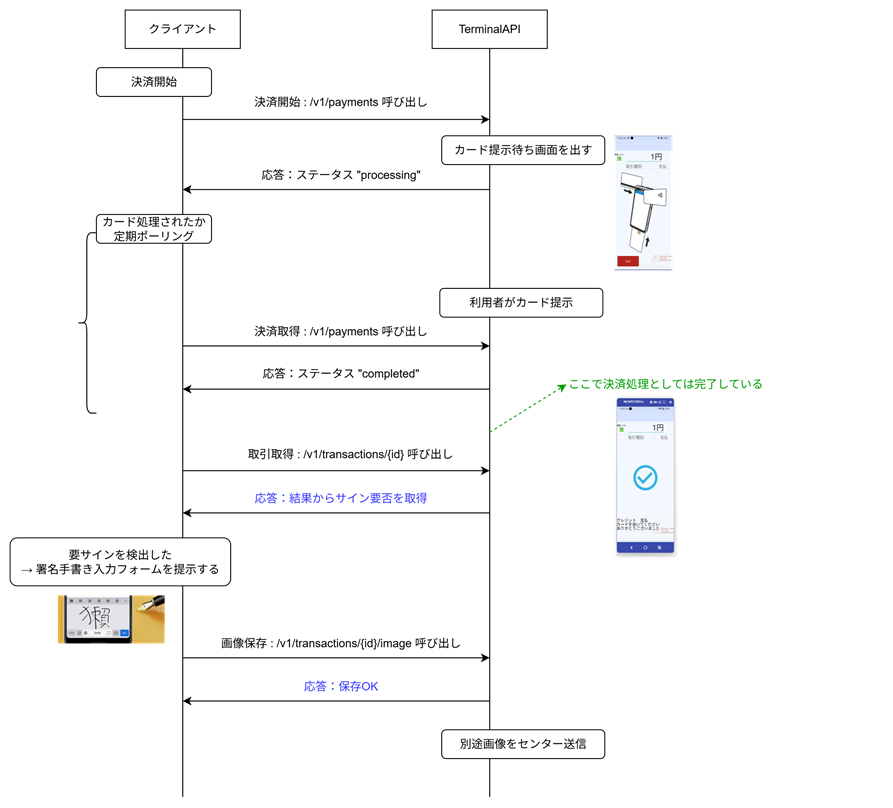
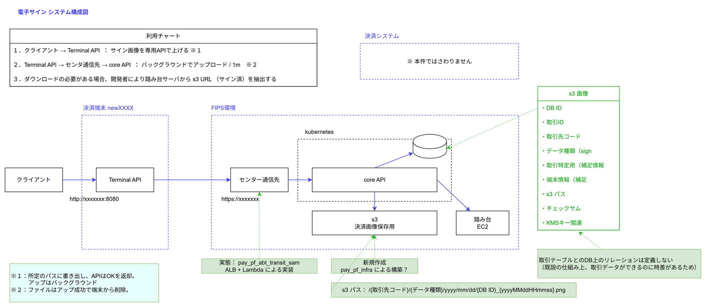

# 電子サイン

## 資料

notion  

[電子サイン]  
https://www.notion.so/XXX-2297cc578ba5800eae1ed87e2c934d3e


[電子レシート]  
https://www.notion.so/2157cc578ba580519d85c24a7c27ec93

## 概要

クレジット決済のレシート印刷の際、クレジットの処理フローで定められている要件により  
利用者の署名を求め、署名欄を印刷する場合がある。  
  
決済 API のクライアントが印刷機能を持たない場合や、  
レシート出力機能のない決済端末を利用する場合、これを電子的なサインデータで賄いたい。

その運用を補完する機能を構築する。

## ユースケース

- 以下の電子サイン機能はクレジット決済のみで適用される。

  - エイジィでの利用時：エイジィクライアントから決済要求する。
    決済完了後、署名が必要な決済の場合に、エイジィクライアントで署名をユーザに手書き入力させる。  
  - エイジィクライアントは手書き入力データを画像変換後、TerminalAPI のインターフェースにて  
    取引IDを指定し、画像保存を行う。
  - 画像保存が行われない場合も、決済は実行されている状態となる。
    取消が必要な場合は、別途、取消APIによる操作をクライアントから実行する必要がある。
  - 保存された画像は TerminalAPI 内で取引データと紐づいている。  
    後方処理にてセンターサーバに画像を連携し、履歴管理に活用する。  
    この際、算出したファイルのハッシュも同時に保存される。

- 今回 STEP では、画像のダウンロードは開発者運用で可能とする。  
  ※ MyFIPS の Web画面からは出ない。  
  また、ダウンロード時にファイルのハッシュ値をセットで情報取得することで、  
  改ざん検出に使用できるものとする。

## 利用フロー




## システム構成サマリ




## 補足事項

#### "署名が必要な状態" とは ？

- 磁気  
  常に紙署名が必要。  
  実際の処理では MS 読込後に即 "署名要" セットされ、以降変化しない。

- 接触  
  CVM Result : TAG 9F54 の結果で判定。  
  先頭バイト bit1-5 が "03" "05" "1F" なら紙署名が必要。  
  これはオンラインオーソリ前に取得可能。

- 非接触  
  EMVL2ライブラリからとれる _emvL2Func.EmvGetCVM() の結果で判定。  
  OBTAIN_SIGNATURE が結果なら紙署名が必要。  
  これはオンラインオーソリ前に取得可能。


#### ハッシュ仕様

- 改ざん検知を目的として、ファイルのバイナリからハッシュコードを取り、対で保存する。
- ハッシュのアルゴリズムは HMAC-SHA256 。
- ハッシュに必要な鍵は取引ごとに AWS KMS から発行する。

#### 手書きフォームの提供

- 今回 STEP では、クライアントが手書き入力結果をアップロードする仕様のため、  
  Terminal API 自身は手書きフォームをサポートしない。

```
サポートする場合、サイン用画面を呼び出すAPIを新設し、手書き入力フォームを表示する方針。
手書き入力フォームにて入力を確定させると、そのまま 画像保存API 呼び出し相当の処理を実行する。
```


#### 運用ルール

フロー上、決済手順の実行後にサイン入力となるので、もしサインがキャンセルされたら取消をクライアント側は実行する必要あり。  
このとき、再度媒体をかざさなければいけない。


## 改修内容

### TerminalAPI 

#### 要件

- API指定で取引と紐づけられた画像データを新規API `取引画像保存API` で保存できること。
-  `取引画像保存API` は画像データごとにハッシュをとる。  
  ハッシュ鍵は、取引ごとに払い出した個別のものを使用する。
-  `取引画像保存API` は 種類:"sign" が指定時、金種:"クレジット" 取引限定で利用できる。
-  `取引画像保存API` は 拡張子 ".png" ファイルを受け付ける。  
   サイズ制限は最大 1MB とする。
- 既設API `取引情報取得` でサインの要不要を判断できるようにする。

```
メモ：電子レシート対応時は、お客様控えと加盟店控えでファイルを分ける必要がある。
```

#### やること

IF追加
- 取引画像保存API  
  - クライアントから指定する項目
    - ファイル.png   ※ 拡張子.png に限定する  
    - 画像の種類 "sign"      （将来 "receipt" を追加）

  - TerminalAPI が保存、サーバアップロードする項目
    - ファイル.png (最大1MB制限)
    - ファイルのハッシュコード（計算する）
    - KMS用キー検索情報がいる
    - 取引ID
    - 取引補足情報
    - 端末ID（トークンからとれたらいらない
    - これ以外もあるかも

IF変更
- 取引情報取得API（既設改修） 
  サインが必要かどうかを判断できる情報をレスポンスに追加する 
  どうやらクレジット処理内の setSignatureFlag() を呼び出しているところで判断がついている模様。これを DBに保存か。

### サーバサイド

#### 要件

- MyFIPS のインフラ・サーバ群に機能を実装する
- 新規 s3 に取引IDから紐づけられたパスでデータを保存する。  
  この s3 は電子レシートの保管にも使用する。
- 保管期間は要件上７年と定義するが、特に削除の仕組みは設けない。
- 今回の開発スコープでは、**MyFIPS, FIGコンソールの WEB画面** からはサインやレシートは DL できない。※ 拡張により対応は可能とする。  
  開発者が踏み台サーバから実行する DL は可能。

#### やること

端末からコールできる公開IF追加

- KMS 鍵発行API
  - 用途：ハッシュ値を取るための鍵情報を取得する。ハッシュ計算自体は端末上でやりたい。
  - クライアントから指定する項目
    - 特になし
  - すでにどこかのマイクロサービスが機能をもってたはずなので、探してつなぎこむ。

- 取引関連画像保存API 
  - クライアントから指定する項目
    - ファイル.png   ※ 拡張子.png に限定する
    - ファイルサイズ 1MB に限定する。WAF 設定が問題ないか要確認  
    - 画像の種類 "sign", "user_receipt", "merchant_receipt" を追加 ※サーバはもうやっとく。
    - その他、DBに保存する項目 

内部向けIF追加

- 取引関連画像取得API 
  - 用途：踏み台などから画像を取得する
  - s3 の presign パスを返す。これを踏むと s3 から直ダウンロードできる。

- インフラ構築
  - 上記を実施するための s3 , 外部接続 , DBスキーマなどの構築。


