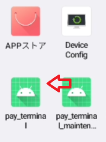

# TerminalAPI攻略

アプリケーション "TerminalAPI" の攻略ガイドです。

## 概要
- アンドロイドアプリ
  - 対象バージョン 13 , 5
- 決済端末 newXXXX シリーズの機能を利用した決済処理提供を大まかな役割とする。

## 外観

## 利用時の構成

- TerminalAPI 単独 (+ MaintenanceAPP)
  - 導入予定：エイジィ xxx

  (画像)

- (TBD) 決済アプリ + TerminalAPI
  
  - 没になった構成案。
  - この構成の場合 MultiPaymentProject でも対応が必要。  
    実際はこの構成は利用しないかもしれないが、保険で `MultiPaymentProject: feature/v1/terminal` ブランチに対応ソースが残されている（未マージ）
  - TerminalAPI に OKICA の種別指定ができるAPIがあるが、
    開局は TerminalAPI でしてない。そのため、OKICAはこの構成でないと動かない。

## 機能一覧

- 起動
- HTTPサービス

### 起動

- PayTerminalApplication 
  - ログ機構の初期化。
  - 例外ハンドラの設置。
  - エラーメッセージ初期化。
  - AppPreference の初期化。
  - 各サブモジュールアプリの init。
  - SDK の init。
  - 非接触soの読み込み。
  - 削除 worker 処理を起動。  
  - room 用の鍵をロード。

- MainActivity
  - 権限要求。 
  - AppPreferenceの 起動時にリセットする項目を初期化。
  - 再開局ハンドラ
  - PayTerminalService の起動。（これにより TCP 8080 で待ち受ける ）
  - タイマーリセットハンドラ
  - Aggregateデータの新規作成。
  - intent で起動している場合は、その情報から Preference 設定
  - WifiDirect （親）の準備。group 作成
  - 電波強度の作成サービスを実行。
  - 定期売上送信処理の起動。
  - 開局チェックバックグラウンド処理 起動。
  - UIの表示。PayTerminalApp を表示する。

## App Preference
保存されずに何かしらで起動時に取得

|| intent | tinfo |
|---|---|---|
| soundPaymentVolume | ◎ | def | 
| soundGuidanceVolume | ◎ | def |
| terminalId | ◎ | ◎ |
| deviceId | ◎ | ◎ |
| staffCode | ◎ | ◎ |
| productCode | ◎ | ◎ |
| merchantTel | ◎ | ◎ |
| merchantOffice | ◎ | ◎ |
| merchantName | ◎ | ◎ |
| receiptTax | ◎ | ◎ |
| invoiceNo | ◎ | ◎ |
| moneyCredit | ◎ | ◎ |
| moneyContactless | ◎ | ◎ |
| moneySuica | ◎ | ◎ |
| moneyId | ◎ | ◎ |
| moneyWaon | ◎ | ◎ |
| moneyNanaco | ◎ | ◎ |
| moneyEdy | ◎ | ◎ |
| moneyQuicpay | ◎ | ◎ |
| moneyOkica | ◎ | ◎ |
| moneyQr | ◎ | ◎ |
| isDriverCodeInput | ◎ | |
| organizationId | | ◎ |
| isServicePos | ◎ | |
| mcCarId | | ◎ |
| mcDriverId | | ◎ |
| driverCode | | |
| mcTermId | | ◎ |
| isWithcash1yen | | ◎ |
| signalStrength | | |

#### Shared Preference
保存される
| intent |  |
|---|---|
| terminal_status | 起動時に初期化されてるもの |
| is_activate | |
| dns_name | |
| wifi_info | |
| ethernet_info | |

## 非推奨
- MainActivity.kt  systemUiVisibility

## 
