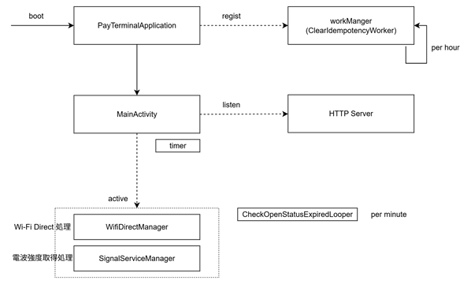

# TerminalAPI攻略

アプリケーション "TerminalAPI" の攻略ガイドです。

## 概要
- アンドロイドアプリ
  - 対象バージョン 13 , 5
- 決済端末 newXXXX シリーズの機能を利用した決済処理提供を大まかな役割とする。

## 外観

## 利用時の構成

- TerminalAPI 単独 (+ MaintenanceAPP)

  - 導入予定：エイジィ xxx  
    - ホテル向け無人決済機を構築したい。  
    - 利用者はエイジィの端末を操作するが、決済機能は Terminal API を利用したい。

### 利用時の構成【没】 

- [没の構成案](./terminal-api-x-top-botu.md)

## 機能一覧

TerminalAPI は主に以下の種類の処理が実装されている。  
詳細は各リンク先へ

- [HTTPサーバ（WebAPI）](./terminal-api-1-0-http.md)
- mDNS サービス
- Wifi Direct 接続（親）
- 各種バックグラウンド処理  
  [リンク](./terminal-api-4-background.md)
　　
　　
　

## ビルド

- リポジトリ  
  https://github.com/MobileCreate/pay_terminal.git  
  `develop` が開発用ブランチ

- JDK  
  gradle の設定を JDK 17 使用し、デバッグ実行を確認。  

  - ※ ちなみに MultiPaymentProject2025 は JDK 11 。

- keystore  
  apk ファイルの署名情報を key.properties から取得しているが、
  この情報はセキュリティ留意のため、ソースリポジトリに含んでいない。  
  このドキュメントがあるフォルダに配置しているため、ビルドの際は このファイルを ソースフォルダのルートに配置すること。

- Android 5 
  特に Android 5 でのビルド時も上記を変える必要はない。
  

## 内部構成

まだ編集中です。

