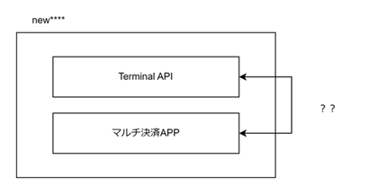

#### 【没】 

- 【没】 決済アプリ + TerminalAPI
  

    - 没になった構成案。
    - この構成の場合 MultiPaymentProject でも連携のための対応が必要。  
     `MultiPaymentProject: feature/v1/terminal` ブランチに対応ソースが残されている（未マージ）
    - が、おそらく使うことはない。（記録で保存しているようなので削除もできない）
    - TerminalAPI には OKICA の種別指定ができるAPIがあるが、単独で開局はしていないため  
      OKICA はこの構成ありきで組まれている。

